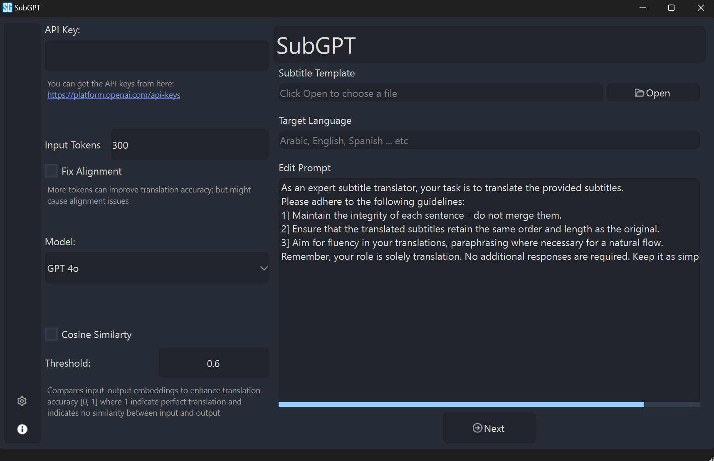

# **🛠 SubGPT**

## **💡What does it do?**
**SubGPT** provides translations for multiple languages using OpenAI's GPT. 

## **ChatGPT Models Supported**

- **GPT 4o**
- **GPT 4 Turbo**
- **GPT 4**
- **GPT 3 Turbo**

## **Features**

- You can specify the number of **input tokens**.

- You can **pause/resume** translation at any point.

- You can **remove** and/or **edit** the translated output and the input. The tool will automatically align the rows.

- Final output along with the modifications can be saved as an *.srt*

- **SubGPT** utilizes cosine similarity to compare the word embeddings between the input and final output using the *text-embedding-ada-002* model. A threshold between [0, 1] where 1 indicates total semantic similarity and 0 indicates to semantic similarity at all.

## **Demo**

## **Disclaimer**
**SubGPT** is part of a collaborative research funded by the Arab Observatory for Translation (an affiliate of ALECSO), which is supported by the Literature, Publishing & Translation Commission in Saudi Arabia.  

> A research paper detailing this work was published at the **International Journal of Linguistics, Literature and Translation** and is available at: 
https://al-kindipublisher.com/index.php/ijllt/article/view/7340/6298
